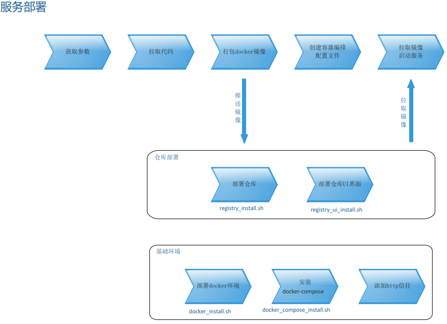

# esi-devops

运维脚本

## 脚本部署流程图



## 目录结构

```markup
--| docker
----| mongo
------| docker-compose.yml __ mongodb 容器的docker-compose
----| mysql
------| docker-compose.yml __ mysql 容器的docker-compose
--| scripts
----| docker_compose_install.sh __ docker compose安装脚本
----| docker_install.sh __ docker安装脚本
----| registry_install.sh __ docker registry安装脚本
----| registry_ui_install.sh __ registry ui安装脚本
----| template-scale-java.sh __ city-fire项目后端部署模板
----| template-scale-vue-nginx.sh __ city-fire项目前端部署模板
----| template-scale.sh __ redis scale模板
----| template.sh __ nodejs微服务生成容器脚本
--| test
----| template.test.sh __ template.sh的测试脚本
----| template-scale-java.test.sh __ template-scale-java.test.sh的测试脚本
----| template-scale-vue-nginx.test.sh __ template-scale-vue-nginx.test.sh的测试脚本
----| template-scale.test.sh __ template-scale.sh的测试脚本
```

## docker registry

- 外网 IP 106.12.161.226
- 内网 IP 192.168.16.5
- 端口 5000

## docker registry UI

- 外网 IP 106.12.161.226
- 内网 IP 192.168.16.5
- 端口 8000
- url [http://106.12.161.226:8000/](http://106.12.161.226:8000/)

## 数据库

### redis

- IP 180.76.155.25
- 端口 6379

### mysql

- IP 180.76.155.25
- 端口 3306
- 默认账号 root
- root 账号密码 Admin123
- 数据库文件路径 /data/mysql/data
- 数据库配置文件 /data/mysql/conf

### mongoDB

- IP 180.76.155.25
- 端口 27017
- 默认账号 无
- 数据库文件路径 /home/mongodb/data/db

## city-fire

### 后端

- IP 180.76.155.25
- 端口 8080
- url [http://180.76.155.25:8080/](http://180.76.155.25:8080/)

### 前端

- IP 180.76.155.25
- 端口 8081
- url [http://180.76.155.25:8081/](http://180.76.155.25:8081/)

## 脚本描述

### docker_install.sh

#### 功能

在 linux 服务器上部署 docker 环境

#### 参数

- \$ver 版本号

#### 逻辑

1. 通过 yum 和 rpm 卸载已有版本；
2. 安装依赖并设置 repo
3. 列出获取到的版本号并让用户选择输入
4. 校验输入并安装

### docker_compose_install.sh

#### 功能

在 linux 服务器上安装 docker-compose

#### 参数

y / n

#### 逻辑

1. 检测是否已部署，没有部署直接安装最新版
2. 通过 curl 获得最新版本号\$ver
3. 已有部署的话，输出版本信息，用户输入 y/n 选择是否升级为最新版

### registry_install.sh

#### 功能

在 linux 服务器上部署 docker-registry

#### 参数

- \$port 仓库端口
- \$location 数据持久化路径
- \$username 仓库用户名
- \$password 仓库密码

#### 逻辑

1. 已有部署清理
2. 根据$username $password 生成密保文件
3. 通过 docker run 部署
4. docker 添加 http 新任并重启 docker 服务

   > 每个需要推送镜像的服务器均需要添加 http 信任

```bash
sudo cat > /etc/docker/daemon.json <<EOF
{
  "insecure-registries": ["${ipaddr}:${port}"]
}
EOF

# Restart docker
systemctl daemon-reload
systemctl restart docker
```

### registry_ui_install.sh

#### 功能

在 linux 服务器上部署 registry 的 ui

#### 参数

- \$url 仓库地址
- \$username registry 的用户名
- \$password registry 的密码
- \$port registry_ui 要使用的端口号
- \$ location registry_ui 数据持久化路径

#### 逻辑

1. 根据参数设定配置文件
2. docker run 启动容器

### template_scale.sh

#### 功能

根据参数打包服务镜像，并推送到之前创建的 registry:192.168.16.5:5000,并通过 docker-compose 启动一个可 scale 的服务

#### 参数

- \$container_name 容器名
- \$cpu_limit cpu 资源限制
- \$cpu_prev cpu 资源预留
- \$data_name volume 路径
- \$ip_address 公网 IP
- \$memo_limit 内存资源限制
- \$memo_prev 内存资源预留
- \$expose_port 容器暴露端口
- \$export_port 服务暴露端口
- \$service_image 镜像名:标签
- \$service_name 服务名
- \$service_restart_policy 服务重启策略
- \$service_env 容器基础发行版
- \$gitrepo 代码库地址
- \$branch 代码分支
- \$cmd 容器初始化命令

#### 逻辑

1. 接受变量并赋值
2. 拉取代码到/tmp/tempworkspace/
3. 在此目录打包镜像并推送到 registry
4. 在/home/\${service_name}下创建 docker-compose.yaml
5. 在/data/\${service_name}下创建持久化目录
6. docker-compose 分为三个服务：
   - dockercloud/haproxy 用来自动发现和反向代理
   - \${service_name} 业务服务
   - Redis 数据库

### template-scale-java.sh

与`template_scale.sh`相同

### template-scale-vue-nginx.sh

与`template_scale.sh`相同
